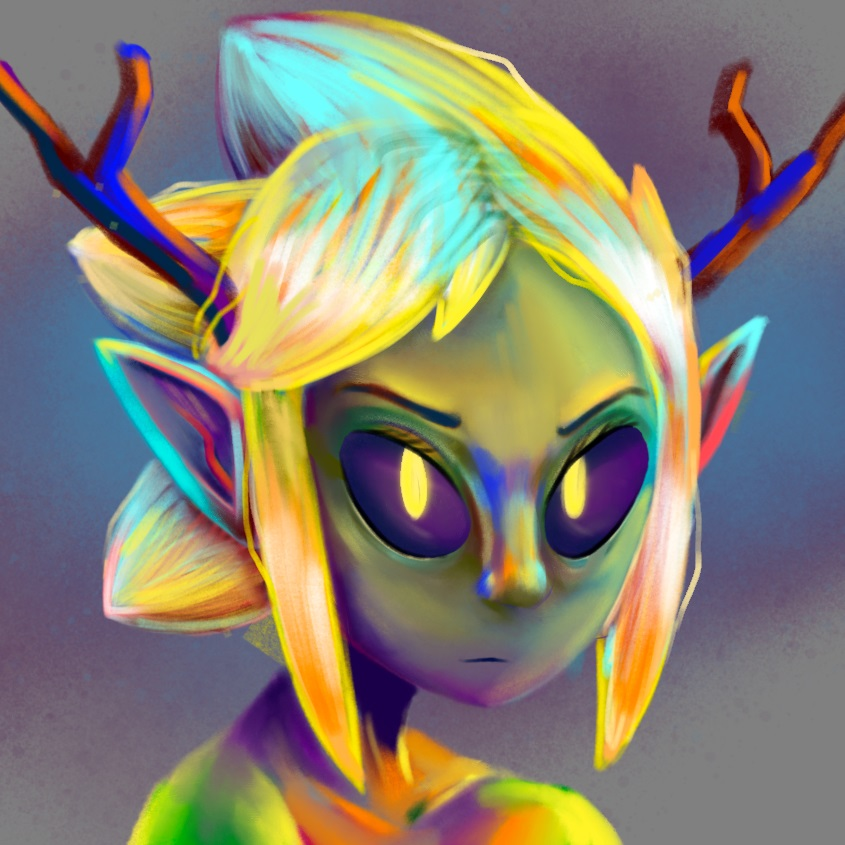

<!DOCTYPE html>
<html lang="en">

<head>
    <meta charset="UTF-8">
    <meta http-equiv="X-UA-Compatible" content="IE=edge">
    <meta name="viewport" content="width=device-width, initial-scale=1.0">
    <meta property="og:locale" content="en_US">
    <meta property="og:type" content="article">
    <meta property="og:title" content="Kaz Newton">
    <meta property="og:description" content="Professional artist based in Indianapolis.">
    <meta property="og:url" content="http://www.kaznoot.art/">
    <meta property="og:site_name" content="Kaz Newton Official Website">
    <meta property="og:image" content="https://i.imgur.com/vYGlluy.png">
    <meta property="og:image:width" content="1380">
    <meta property="og:image:height" content="1380">

    <title>Kaz Newton</title>

    <link rel="stylesheet" href="style.css">
    <link rel="stylesheet" href="hover.css">
    <link rel="shortcut icon" type="image/jpg" href="images/favicon2.png" />

    
    
</head>

<body>
    <!--Wrapper contains all information-->
    

        <!--Main information-->
        

            

                <!--Avatar-->
                

                <!--Name-->
                <h1 id="name" class="head">Kaz Newton</h1>

                <!--icon hyper links-->
                

                    <a href="https://www.instagram.com/kaznoot/?hl=en" target="_blank">
                        <i class="fab fa-instagram fa-2x hvr-grow" id="instagram"></i>
                    </a>

                    <a href="https://www.artstation.com/kaznoot" target="_blank">
                        <i class="fab fa-artstation fa-2x hvr-grow" id="artstation"></i>
                    </a>

                    <a href="mailto:kaznoot@gmail.com" target="_blank">
                        <i class="far fa-envelope fa-2x hvr-grow" id="email"></i>
                    </a>
                    <a href="error.html" target="_blank">
                        <i class="fab fa-paypal fa-2x hvr-grow" id="paypal"></i>
                    </a>

                    <a href="https://www.youtube.com/channel/UCrE1fzoHjD2PWNpKOHcr2sA" tarket="_blank">
                        <i class="fab fa-youtube fa-2x hvr-grow" id="youtube"></i>
                    </a>

                    <a href="https://twitter.com/kaznoot" target="_blank">
                        <i class="fab fa-twitter fa-2x hvr-grow" id="twitter"></i>
                    </a>

                

            

            
Hi, <b>I'm Kaz.</b> I'm a professional illustrator based in Indianapolis.
                On this page you can find links to all of my socials and multiple ways to contact me. Feel free to join
                me on my art journey!
                  Commissions are currently <b>CLOSED.</b>
            

            <!--Gallery-->
            

                <a href="https://www.artstation.com/artwork/q9kqZn" target="_blank" id="link1"></a>
                <a href="https://www.artstation.com/artwork/QrQbor" target="_blank" id="link2"></a>
                <a href="https://www.artstation.com/artwork/189AZK" target="_blank" id="link3"></a>
                <a href="https://www.artstation.com/artwork/0nQALG" target="_blank" id="link4"></a>
                <a href="https://www.artstation.com/artwork/lxkJa5" target="_blank" id="link5"></a>
                <a href="https://www.artstation.com/artwork/w6k15V" target="_blank" id="link6"></a>
                <a href="https://www.artstation.com/artwork/q9kqON" target="_blank" id="link7"></a>
                <a href="https://www.artstation.com/artwork/rAko2m" target="_blank" id="link8"></a>
                <a href="https://www.artstation.com/artwork/J9YXg0" target="_blank" id="link9"></a>
            

        

        <!--End of Main Information-->

        <!-- Progress side of the page -->
        

            

                <!-- This is always the header -->
                <h2>Check out my current project!</h2>
                <h4>Last Updated 9/21/2021</h4>
                <!-- Type here -->
                <iframe src="https://www.youtube-nocookie.com/embed/OyUTuMj_xqI" class="square"
                    title="YouTube video player" frameborder="0"
                    allow="accelerometer; autoplay; clipboard-write; encrypted-media; gyroscope; picture-in-picture"
                    allowfullscreen></iframe>
                

                    This drawing is a piece I made for Inktober. The prompt, "Suit," is the second prompt of the month.
                    For this prompt I decided to draw a female character in what most people refer to as a "bunny suit,"
                    usually because the outfits feature a bunny tail on the rear end.    The process was
                    pretty simple since I was mainly doing this project for fun. You see mostly every step in the video
                    other then when I looked up references for the pose.   First, I started with a sketch of a
                    figure, using a reference. After that I got a peer critique and made some minor adjustments in her
                    arms to help increase flow. After that, I traced the perspective points based off my
                    reference and constructed my own "bar scene" background. Coloring was a straight forward process of
                    using ink themed brushes inside Procreate to help fit the Inktober theme!  I'm quite happy
                    with the final result considering I didn't expect to spend so much time on it. Hopefully others
                    enjoy it as well :)
                

                <!--<h3>It's Summer time!</h3>
                

                    After 2 long semester's with classes steeped in the covid-19 pandemic, I'm taking a short break for
                    the summer. Feel free to check back later! You never know when inspiration may
                    strike.  See you
                    next semester! :)
                
 -->
            

            <!-- End of Type -->
        

        <!-- End of progress -->

    

    <!--END OF WRAPPER-->
</body>

</html>